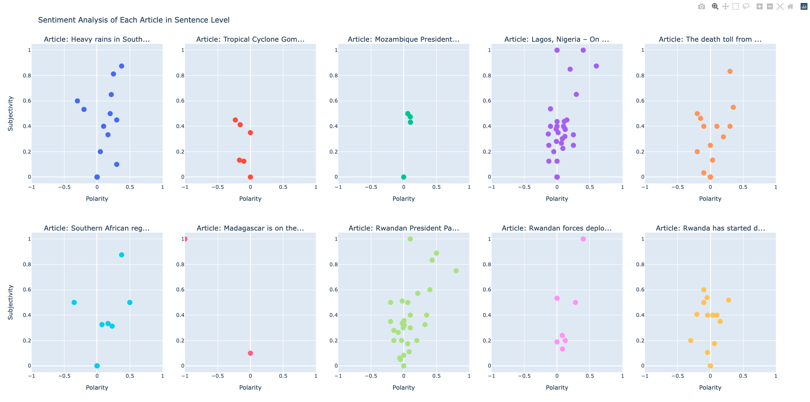

# Web Scraping & Sentiment Analysis

## Web Scraping Instructions
Run scrape.py to output the results of web scraping as output.json.  
## Web Scraping Description
The web scraping code is described in scrape.py. Beautiful Soup was used in this program to scrape the ten most recent news items listed at https://www.aljazeera.com/where/mozambique/. The JSON contains the title, subtitle, contents, image(URL link), figure caption, publication date, and data source. See comments in scrape.py for specific functionality of the code.  

## Sentiment Analysis Instructions
Run sentiment.py to compute the sentiment of each news article and display the sentiment analysis results in the browser.  
## Sentiment Analysis Description
Sentiment analysis was performed using TextBlob.
After removing unnecessary data such as publication date and images by extracting contents from JSON and confirming that the article is in English, sentiment analysis was performed on the entire article (Entire.png) and each sentence (Sentence.png).
Entire.png provides an overview of the overall sentiment trends of Aljazeera news in Mozambique, while Sentence.png provides more detailed sentiment analysis of each article.
See the comments on sentiment.py for the specific functionality of the code.  
## Sample Results

  

## Total operation time  
4 hours
