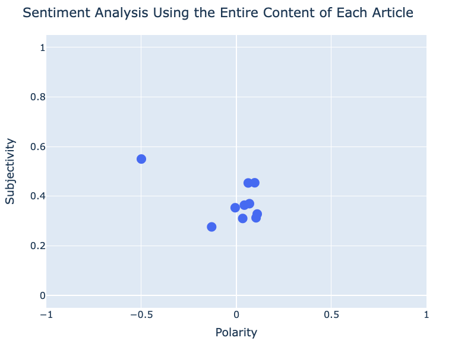

# Web Scraping & Sentiment Analysis

## Web Scraping Instructions
Run scrape.py to output the results of web scraping as output.json.  
## Web Scraping Description
The web scraping code is described in scrape.py. Beautiful Soup was used to scrape the ten most recent news items listed at https://www.aljazeera.com/where/mozambique/. The JSON contains the title, subtitle, contents, image(URL link), figure caption, publication date, and data source. See comments in scrape.py for specific functionality of the code.  

## Sentiment Analysis Instructions
Run sentiment.py to compute the sentiment of each news article and display the sentiment analysis results in the browser.  
## Sentiment Analysis Description
Sentiment analysis was performed using TextBlob.
After removing unnecessary data such as publication date and images by extracting contents from JSON and confirming that the article is in English, sentiment analysis was performed on the entire article (Entire.png) and each sentence (Sentence.png).
Entire.png provides an overview of the overall sentiment trends of Aljazeera news in Mozambique, while Sentence.png provides more detailed sentiment analysis of each article.
See the comments on sentiment.py for the specific functionality of the code.  
## Results
fig1: Sentiment Analysis Using the Entire Content of Each Article 

  

fig2: Sentiment Analysis of Each Article in Sentence Level

  

The sentiment analysis results for the entire article show that Polarity did not swing significantly between positive and negative and was generally slightly more positive than zero.
Subjectivity also did not swing significantly from article to article and was generally concentrated around 0.4. Note that although one article is largely negative, with a Polarity of -0.5, this article is mainly video, and the text itself is very short, so it cannot be taken as meaningful data.  

Although the articles analyzed in this study contained negative themes such as natural disasters and conflicts, the news articles did not significantly impact Polarity because it seems they only reported factual information.

Because TextBlob's use of a weighted average of sentiment scores, there is a possibility that the large positive scores may offset the large negative scores. However, the sentiment analysis of each article at the sentence level did not show significant positive or negative swings in Polarity, supporting the above considerations.  

## Total operation time  
4.5 hours
